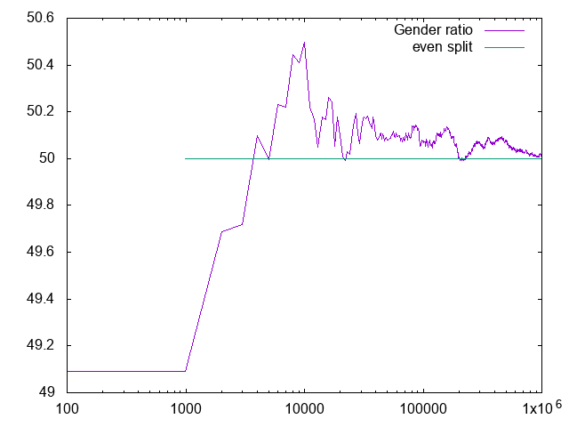

# Gender ratio

The question is "If people only had children until the first girl is born what would be the gender ratio". It asks to figure this out logically first and then to code it. 

The logic would suggest this:

* 1/2 have 0 boys / 1 girl - ratio 1/1
* 1/4 have 1 boy / 1 girl - ratio 1/2
* 1/8 have 2 boys / 1 girl - ratio 1/3
* 1/16 have 3 boys / 1 girl - ratio 1/4
* ...

The formula then would be sum(1/2^n * 1/n) which according to 
[Wolfram alpha](https://www.wolframalpha.com/input/?i=sum((1%2F2%5En)*(1%2Fn)))
should be log(2) or about 69% girls.

It turns out the simulation results are counterintutive so this is post hoc rationalization of the graph:

Reading the book it uses similar logic but focuses on the number of boys (note that the book has a mistake in the formula nd that the formula should be sum(i/2^(i+1) rather than the written sum(i/2^i). It thus arrives at the idea that it should be 50%.
